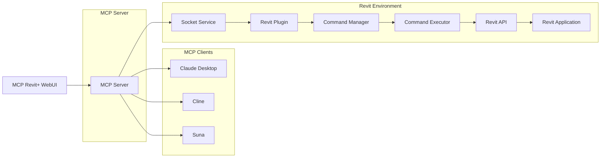

# MCP Revit+ 綜合開發輔助工具

<div align="center">
  
  
  <h3>���️ AI Modeling + ��� Full-Stack Developer = ��� WEBUI</h3>
  
  [](https://reactjs.org/)
  [](https://vitejs.dev/)
  [](LICENSE)
</div>

## ��� 專案簡介

**MCP Revit+** 是一個AI輔助建模的工具，BIM ISV透過LLM的解析，使用WEBUI簡易的Chatbot模式，將複雜的判斷與工具調用融合得如同人與人之間的對話一樣簡單。每一個BIMer透過自然語言驅動AI來與軟體對話，讓建築師、工程師和開發者只需要在一個平台上，就能做到從部署到建模的完整工作流。

### ��� 核心特色

- ��� **AI ChatBot UI** - 使用自然語言串接LLM+MCP+Revit進行建模工作
### ��� 核心特色

- ��� **AI ChatBot UI** - 使用自然語言串接LLM+MCP+Revit進行建模工作
- ��� **即時語音輸入** - 支援語音轉文字，提升操作效率
- ��� **智能指令庫** - RAG 驅動的指令建議和歷史記錄管理
- ���️ **自動分類標籤** - 智能分析指令參數並自動分類
- ��� **動態 GPU 監控** - nvitop 風格的實時性能監控與進度條
- ⚙️ **完整設定系統** - 支援 MCP Server、Client、LLM 等模組配置
- ���️ **全棧開發工具** - 集成代碼檢查、Git 管理、Docker 部署等功能
- ��� **Figma 風格 UI** - 現代化設計語言，流暢的動畫效果
- ��� **模組化架構** - 可擴展的工具設計
## ��� 快速開始

### 環境需求

- Node.js 18.0+ 
- npm 或 pnpm
- Revit 2024+ (用於 Modeling 功能)
- LM Studio (用於 LLM 模型選用)

### 安裝步驟

1. **克隆專案**
   ```bash
   git clone https://github.com/your-username/mcp-revit-plus.git
   cd mcp-revit-plus
   ```

2. **安裝依賴**
   ```bash
   npm install
   ```

3. **啟動開發服務器**
   ```bash
   npm run dev
   ```

4. **開啟瀏覽器**
   ```
   http://localhost:5173
   ```

### MCP Server 搭建

MCP Server 是連接 AI 客戶端與 Revit 的核心橋樑，基於 [revit-mcp](https://github.com/revit-mcp/revit-mcp) 專案。

#### 1. 安裝 MCP Server

```bash
# 克隆 MCP Server
git clone https://github.com/revit-mcp/revit-mcp.git
cd revit-mcp

# 安裝依賴並建構
npm install
npm run build
```

#### 2. 配置 MCP 客戶端

**Claude Desktop 配置**

編輯 Claude Desktop 配置文件 `claude_desktop_config.json`：
```json
{
  "mcpServers": {
    "revit-mcp": {
      "command": "node",
      "args": ["<path-to-revit-mcp>/build/index.js"]
    }
  }
}
```

**Cline 配置**

在 Cline 設定中添加 MCP Server 連接。

**Suna 配置**

參考 Suna 官方文檔配置 MCP 連接。

#### 3. 安裝 Revit 插件

**方案一：C# 插件 (revit-mcp-plugin)**

```bash
# 下載插件
git clone https://github.com/revit-mcp/revit-mcp-plugin.git
```

在 Revit 插件目錄中添加 `.addin` 文件：
```xml
<?xml version="1.0" encoding="utf-8"?>
<RevitAddIns>
  <AddIn Type="Application">
    <Name>revit-mcp</Name>
    <Assembly>%your_path%\revit-mcp-plugin.dll</Assembly>
    <FullClassName>revit_mcp_plugin.Core.Application</FullClassName>
    <ClientId>090A4C8C-61DC-426D-87DF-E4BAE0F80EC1</ClientId>
    <VendorId>revit-mcp</VendorId>
    <VendorDescription>https://github.com/revit-mcp/revit-mcp-plugin</VendorDescription>
  </AddIn>
</RevitAddIns>
```

**方案二：Python 擴展 (RevitMCP.extension)**

```bash
# 下載 Python MCP 擴展
git clone https://github.com/oakplank/RevitMCP.git
```

1. **安裝 pyRevit**
   - 從 [pyrevitlabs.io](https://pyrevitlabs.io/) 下載並安裝 pyRevit
   - 確保 pyRevit 與您的 Revit 版本相容

2. **安裝 RevitMCP 擴展**
   ```bash
   # 複製擴展到 pyRevit 目錄
   cp -r RevitMCP/RevitMCP.extension %APPDATA%/pyRevit/Extensions/
   ```

3. **安裝 Python 依賴**
   ```bash
   pip install Flask>=2.0 requests>=2.25 openai anthropic google-generativeai flask-cors
   ```

#### 4. 配置 Revit 插件

**C# 插件配置**

1. **啟動 Revit**
2. **配置命令集**：Add-in Modules -> Revit MCP Plugin -> Settings
3. **啟用服務**：Add-in -> Revit MCP Plugin -> Revit MCP Switch

**Python 擴展配置**

1. **啟用 pyRevit Routes 服務器**
   - 開啟 Revit
   - 進入 pyRevit Tab -> Settings
   - 啟用 "Routes" 或 "Web Server" 功能
   - 預設端口：48884（第一個 Revit 實例）

2. **啟動 MCP 服務器**
   - 在 Revit 中點擊 "Launch RevitMCP" 按鈕
   - 或手動執行：`python server.py`

當看到 Claude Desktop 中出現錘子圖標時，表示 MCP 服務連接正常。


## ���️ 系統架構



### 架構說明

1. **MCP Revit+ WebUI** - 提供友好的網頁界面
2. **MCP Server** - 基於 revit-mcp 的協議服務器
3. **MCP Clients** - 支援 Claude Desktop、Cline、Suna 等客戶端
4. **Socket Service** - 處理與 Revit 插件的通訊
5. **Revit Plugin** - 在 Revit 中執行具體操作
6. **Command System** - 管理和執行各種建模命令


## ���️ 功能模組

### ���️ BIM 建模助手
- **智能建模** - 自然語言轉換為 Revit 操作
- **元素管理** - 牆體、門窗、樓梯等建築元素
- **模型分析** - 自動統計和分析建築模型
- **參數化設計** - 動態調整建築參數


#### MCP 支援的 Revit 工具

| 工具名稱 | 功能描述 |
|---------|----------|
| `get_current_view_info` | 取得當前視圖資訊 |
| `get_current_view_elements` | 取得當前視圖中的元素 |
| `get_available_family_types` | 取得專案中可用的族類型 |
| `get_selected_elements` | 取得選中的元素 |
| `create_point_based_element` | 建立點基元素（門、窗、家具） |
| `create_line_based_element` | 建立線基元素（牆、樑、管道） |
| `create_surface_based_element` | 建立面基元素（樓板、天花板） |
| `delete_elements` | 刪除元素 |
| `reset_model` | 重置模型（清除連續對話中的處理模型） |
| `modify_element` | 修改元素屬性（實例參數） |
| `search_modules` | 搜尋可用模組 |
| `use_module` | 使用模組 |
| `send_code_to_revit` | 傳送程式碼到 Revit 執行 |

#### Python 擴展額外功能

| 功能名稱 | 功能描述 |
|---------|----------|
| `project_info` | 取得專案基本資訊和元數據 |
| `element_selection` | 按類別、屬性或自定義篩選器選擇元素 |
| `parameter_management` | 讀取和更新元素參數（含類型驗證） |
| `sheet_placement` | 自動將視圖放置到新圖紙上 |
| `view_management` | 管理視圖和圖紙 |
| `family_management` | 族類型管理和載入 |
| `ai_integration` | 與 AI 助手的自然語言整合 |
| `fuzzy_matching` | 模糊匹配視圖名稱 |
| `auto_numbering` | 自動圖紙編號（D001、S001 等） |
| `titleblock_selection` | 智能標題欄選擇 |
| `viewport_creation` | 視口建立和管理 |

#### 圖紙放置工具範例

```python
# 自然語言指令範例
"Place detail foundation onto a sheet"
"Put section A-A on a new sheet"
```

該工具會自動：
- 使用模糊匹配找到視圖名稱
- 建立適當編號的新圖紙（D001、S001 等）
- 將視圖放置在圖紙中心
- 處理標題欄選擇和視口建立

| `color_splash` | 根據參數值為元素著色 |
| `tag_walls` | 為視圖中所有牆體添加標籤 |

### ��� 開發工具箱
- **代碼檢查** - 實時代碼品質分析
- **Git 管理** - 版本控制和協作功能
- **Docker 容器** - 容器化部署管理
- **API 測試** - RESTful API 測試工具
- **Bug 追蹤** - 錯誤監控和修復建議
- **文檔生成** - 自動生成技術文檔

### ��� 系統監控
- **GPU 監控** - 實時顯示 GPU 使用率、記憶體和溫度
- **系統狀態** - LM Studio、Revit、MCP 協調器狀態
- **性能分析** - 系統資源使用情況


## ��� WebUI 功能特色

### ��� 即時語音輸入
- **語音轉文字**: 支援繁體中文語音識別
- **即時反饋**: 顯示語音識別狀態和結果
- **連續對話**: 支援連續語音輸入模式
- **多語言支援**: 可切換不同語言的語音識別

### ��� 智能指令庫
- **RAG 驅動建議**: 基於上下文的智能指令推薦
- **歷史記錄管理**: 自動記錄和分析使用頻率
- **分類搜尋**: 支援關鍵字和標籤搜尋
- **快速插入**: 一鍵插入常用指令

### ���️ 自動分類標籤
- **智能分析**: 自動分析指令內容並分類
- **使用統計**: 顯示各分類的使用頻率
- **視覺化標籤**: 彩色標籤系統便於識別
- **篩選功能**: 按分類篩選歷史記錄

### ��� 動態 GPU 監控
- **nvitop 風格**: 仿照 nvitop 的專業監控介面
- **實時數據**: GPU 使用率、記憶體、溫度監控
- **進度條動畫**: 動態進度條顯示使用狀況
- **懸停展開**: 滑鼠懸停顯示詳細資訊
- **歷史圖表**: 顯示性能變化趨勢

### ⚙️ 完整設定系統
- **MCP Server 配置**: URL、超時、連接狀態
- **MCP Client 設定**: 支援 Claude Desktop、Cline、Suna
- **LLM 提供商**: Anthropic、OpenAI、Google AI、本地模型
- **Revit 插件**: C# 插件和 Python 擴展雙重支援
- **介面偏好**: 主題、語言、動畫效果設定
- **連接測試**: 一鍵測試各模組連接狀態

### ��� Figma 風格設計
- **現代化 UI**: 採用 Figma 設計語言
- **流暢動畫**: Framer Motion 驅動的過渡效果
- **響應式佈局**: 適配不同螢幕尺寸
- **玻璃態效果**: 現代化的視覺效果
- **自定義主題**: 支援淺色/深色模式

## ��� 使用指南

### 基本操作

1. **啟動應用** - 開啟瀏覽器訪問 \`http://localhost:5173\`
2. **選擇工具** - 點擊右上角設置按鈕開啟工具箱
3. **輸入指令** - 在對話框中使用自然語言描述需求
4. **查看結果** - 系統會自動執行相應操作並顯示結果

### 快速指令範例

#### BIM 建模指令
```
建立一個長10米、寬0.2米、高3米的混凝土牆
添加一扇門到選中的牆
建立一個直線樓梯
查詢當前模型的元素數量
```

#### 開發工具指令
```
檢查代碼品質
運行單元測試
部署到測試環境
生成API文檔
```

#### Python 擴展指令
```
取得專案資訊和元數據
將基礎詳圖放置到圖紙上
把剖面 A-A 放到新圖紙
按類別選擇所有牆體
更新選中元素的參數
載入新的族類型
建立帶自動編號的圖紙
為所有門添加標籤
根據高度為牆體著色
```
```

### MCP 客戶端使用

#### Claude Desktop 使用

1. **確認連接**：啟動 Claude Desktop，看到錘子圖標表示 MCP 連接成功
2. **開始對話**：直接使用自然語言與 Claude 對話
3. **Revit 操作**：Claude 會自動調用 MCP 工具與 Revit 互動

範例對話：
```
用戶：請幫我在當前視圖中建立一面長度為 10 米的牆
Claude：我來幫您建立一面 10 米長的牆。首先讓我查看當前視圖的資訊...
[Claude 自動調用 get_current_view_info 工具]
[Claude 自動調用 create_line_based_element 工具]
```

#### Cline 使用

1. **配置 MCP**：在 Cline 中配置 MCP Server 連接
2. **程式碼生成**：Cline 可以生成 Revit API 程式碼
3. **自動執行**：透過 `send_code_to_revit` 工具執行生成的程式碼

#### Suna 使用

1. **連接設定**：配置 Suna 與 MCP Server 的連接
2. **多模態互動**：支援文字、圖片等多種輸入方式
3. **智能建模**：結合視覺理解進行建模操作

檢查代碼品質
運行單元測試
部署到測試環境
生成API文檔
```

## ��� 技術棧

### 前端技術
- **React 19.1.0** - 用戶界面框架
- **Vite 6.3.5** - 快速建構工具
- **Tailwind CSS** - 實用優先的 CSS 框架
- **Framer Motion** - 動畫庫
- **Radix UI** - 無障礙 UI 組件
- **Lucide React** - 圖標庫

### 後端整合
- **MCP (Model Context Protocol)** - AI 模型協調協議
- **revit-mcp Server** - 基於 TypeScript 的 MCP 服務器
- **revit-mcp-plugin** - Revit 插件（C# .NET）
- **RevitMCP.extension** - pyRevit Python 擴展
- **Socket.IO** - 實時雙向通訊
- **Revit API** - BIM 建模接口
- **LM Studio** - 本地 AI 模型服務
- **Docker API** - 容器管理
- **Git API** - 版本控制

### Python 技術棧
- **pyRevit** - Revit Python 開發環境
- **Flask** - Python Web 框架
- **Requests** - HTTP 請求庫
- **OpenAI API** - GPT 模型整合
- **Anthropic API** - Claude 模型整合
- **Google Generative AI** - Gemini 模型整合
- **Flask-CORS** - 跨域資源共享

### MCP 客戶端支援
- **Claude Desktop** - Anthropic 官方桌面客戶端
- **Cline** - VS Code 擴展的 AI 助手
- **Suna** - 多模態 AI 本地佈署客戶端
- **其他 MCP 相容客戶端** - 支援標準 MCP 協議的客戶端

## ��� 貢獻指南

我們歡迎社群貢獻！請遵循以下步驟：

1. Fork 專案
2. 創建功能分支 (\`git checkout -b feature/AmazingFeature\`)
3. 提交變更 (\`git commit -m 'Add some AmazingFeature'\`)
4. 推送到分支 (\`git push origin feature/AmazingFeature\`)
5. 開啟 Pull Request

## ��� 授權條款

本專案採用 MIT 授權條款 - 詳見 [LICENSE](LICENSE) 文件。

## ��� 致謝

- [Autodesk Revit](https://www.autodesk.com/products/revit) - BIM 建模平台
- [pyRevit](https://pyrevitlabs.io/) - Revit Python 開發環境
- [revit-mcp](https://github.com/revit-mcp/revit-mcp) - MCP Server 實現
- [RevitMCP](https://github.com/oakplank/RevitMCP) - Python MCP 擴展
- [LM Studio](https://lmstudio.ai/) - 本地AI LLM模型服務
- [React](https://reactjs.org/) - 用戶界面框架
- [Vite](https://vitejs.dev/) - 建構工具
- [Tailwind CSS](https://tailwindcss.com/) - CSS 框架

---

<div align="center">
  <p>��� 如果這個專案對您有幫助，請給我們一個 Star！</p>
  <p>Made with ❤️ by the MCP Revit+ Team</p>
</div>
